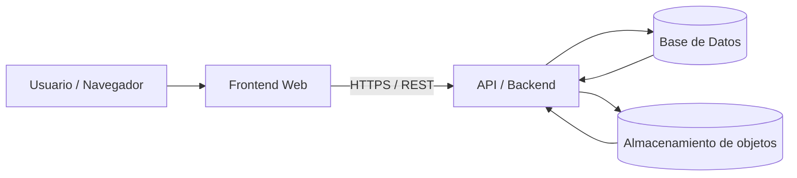

# # Tarea (a+b) · Cloud: niveles y funciones (DAW 1º)

## 🅰️ Tarea A — Niveles de cloud (IaaS/PaaS/SaaS)
Crea una tabla con 10 servicios reales. Incluye enlace oficial y justifica responsabilidades.

| **Servicio**               | **Proveedor**       | **Nivel (IaaS/PaaS/SaaS)** | **Enlace oficial**                                                                                               | **¿Qué gestiona el proveedor?**                                                        | **¿Qué gestiona el equipo/usuario?**                                                              |
| -------------------------- | ------------------- | -------------------------- | ---------------------------------------------------------------------------------------------------------------- | -------------------------------------------------------------------------------------- | ------------------------------------------------------------------------------------------------- |
| **Amazon EC2**             | Amazon Web Services | IaaS                       | [https://aws.amazon.com/ec2/](https://aws.amazon.com/ec2/)                                                       | Hardware físico, red, almacenamiento, virtualización del servidor.                     | Sistema operativo, aplicaciones, configuraciones, seguridad interna. ([Wikipedia][1])             |
| **Google Compute Engine**  | Google Cloud        | IaaS                       | [https://cloud.google.com/compute](https://cloud.google.com/compute)                                             | Infraestructura virtual, redes, discos, alta disponibilidad.                           | SO, aplicaciones, administración de instancias. ([Wikipedia][2])                                  |
| **Azure Virtual Machines** | Microsoft Azure     | IaaS                       | [https://azure.microsoft.com/services/virtual-machines/](https://azure.microsoft.com/services/virtual-machines/) | Infraestructura de máquinas virtuales, redes, almacenamiento.                          | Sistema operativo, software, configuración de seguridad. ([Medium][3])                            |
| **AWS Elastic Beanstalk**  | Amazon Web Services | PaaS                       | [https://aws.amazon.com/elasticbeanstalk/](https://aws.amazon.com/elasticbeanstalk/)                             | Plataforma completa de despliegue, aprovisionamiento de recursos, balanceo, escalado.  | Código de la aplicación, configuración de entorno de ejecución. ([Wikipedia][4])                  |
| **Heroku**                 | Salesforce          | PaaS                       | [https://www.heroku.com/](https://www.heroku.com/)                                                               | Entorno de ejecución, automatización de despliegue, escalado y mantenimientos básicos. | Desarrollo de la aplicación, dependencias de código, configuraciones de add-ons. ([Wikipedia][5]) |
| **Google App Engine**      | Google Cloud        | PaaS                       | [https://cloud.google.com/appengine](https://cloud.google.com/appengine)                                         | Plataforma de ejecución automática, escalado, mantenimiento de runtime.                | Lógica de aplicación, código y recursos del proyecto. ([Wikipedia][2])                            |
| **Microsoft 365**          | Microsoft           | SaaS                       | [https://www.microsoft.com/microsoft-365](https://www.microsoft.com/microsoft-365)                               | Aplicaciones listas para usar, infraestructura, datos, seguridad y actualizaciones.    | Gestión de cuentas, configuración de usuarios y datos propios. ([Economize Cloud][6])             |
| **Salesforce CRM**         | Salesforce          | SaaS                       | [https://www.salesforce.com/](https://www.salesforce.com/)                                                       | Software de CRM, bases de datos de cliente, actualizaciones continuas.                 | Configuración de procesos, datos de clientes, permisos de usuario. ([Economize Cloud][6])         |
| **Google Workspace**       | Google              | SaaS                       | [https://workspace.google.com/](https://workspace.google.com/)                                                   | Aplicaciones colaborativas (Gmail, Docs, Drive), almacenamiento de datos, backups.     | Gestión de usuarios, configuraciones de seguridad, datos. ([Economize Cloud][6])                  |
| **Dropbox**                | Dropbox, Inc.       | SaaS                       | [https://www.dropbox.com/](https://www.dropbox.com/)                                                             | Aplicación de almacenamiento y sincronización de archivos, infraestructura backend.    | Organización de archivos, permisos de carpeta y uso de la app. ([Economize Cloud][6])             |

[1]: https://en.wikipedia.org/wiki/Amazon_Elastic_Compute_Cloud?utm_source=chatgpt.com "Amazon Elastic Compute Cloud"
[2]: https://en.wikipedia.org/wiki/Google_Cloud_Platform?utm_source=chatgpt.com "Google Cloud Platform"
[3]: https://medium.com/funtech-academy/understanding-azure-services-iaas-paas-saas-and-their-aws-equivalents-9dfcf4b2b7bb?utm_source=chatgpt.com "Understanding Azure Services: IaaS, PaaS, SaaS, and Their AWS Equivalents | by Priyakant Charokar | FunTech Academy | Medium"
[4]: https://es.wikipedia.org/wiki/AWS_Elastic_Beanstalk?utm_source=chatgpt.com "AWS Elastic Beanstalk"
[5]: https://es.wikipedia.org/wiki/Heroku?utm_source=chatgpt.com "Heroku"
[6]: https://www.economize.cloud/blog/cloud-service-providers/?utm_source=chatgpt.com "Top 13 Cloud Service Providers You Should Know"

## 🅱️ Tarea B — Funciones principales de cloud (arquitectura)

### 📐 Diagrama (arquitectura cloud típica)

---

### 🧠 Explicación (8–12 líneas)

El usuario accede a la aplicación desde un navegador o cliente móvil, que actúa como frontend.
Este frontend suele estar desplegado en servicios cloud gestionados (por ejemplo, hosting web o CDN).
Las peticiones se envían mediante HTTPS a una API alojada en la nube.
La API se ejecuta sobre servicios de computación cloud que escalan automáticamente según la carga.
El backend procesa la lógica de negocio y valida las peticiones.
Para persistir la información, la API accede a una base de datos en la nube.
Los archivos o contenidos pesados se guardan en almacenamiento de objetos cloud.
El proveedor cloud gestiona la infraestructura, la red y la alta disponibilidad.
El equipo de desarrollo se centra en el código, los datos y la configuración de seguridad.

---

### 🗺️ Mapeo de funciones cloud a componentes

* **Procesamiento** → Backend / API ejecutándose en máquinas virtuales o contenedores (IaaS / PaaS).
* **Ejecución** → Plataforma de ejecución gestionada (por ejemplo, servicios PaaS o funciones serverless).
* **Almacenamiento** → Bases de datos cloud y almacenamiento de objetos (DBaaS / Object Storage).
* **Intercambio** → Red cloud, balanceadores de carga y APIs REST sobre HTTPS.

---

## 📚 Fuentes (enlaces oficiales)

**Usadas en la Tarea A**

* Amazon EC2: [https://aws.amazon.com/ec2/](https://aws.amazon.com/ec2/)
* AWS Elastic Beanstalk: [https://aws.amazon.com/elasticbeanstalk/](https://aws.amazon.com/elasticbeanstalk/)
* Microsoft Azure Virtual Machines: [https://azure.microsoft.com/services/virtual-machines/](https://azure.microsoft.com/services/virtual-machines/)
* Google App Engine: [https://cloud.google.com/appengine](https://cloud.google.com/appengine)
* Heroku: [https://www.heroku.com/](https://www.heroku.com/)
* Microsoft 365: [https://www.microsoft.com/microsoft-365](https://www.microsoft.com/microsoft-365)
* Salesforce CRM: [https://www.salesforce.com/](https://www.salesforce.com/)
* **Google Workspace**: [https://workspace.google.com/](https://workspace.google.com/)
* Dropbox: [https://www.dropbox.com/](https://www.dropbox.com/)

**Usadas en la Tarea B (arquitectura cloud)**

* IBM — IaaS, PaaS y SaaS: [https://www.ibm.com/think/topics/iaas-paas-saas](https://www.ibm.com/think/topics/iaas-paas-saas)
* Google Cloud Architecture Center: [https://cloud.google.com/architecture](https://cloud.google.com/architecture)

---

Si quieres, puedo **adaptar el diagrama a un caso concreto** (por ejemplo, usando Google Workspace + App Engine, o una arquitectura 100 % AWS) o **simplificar el texto para nivel ESO/FP**.
